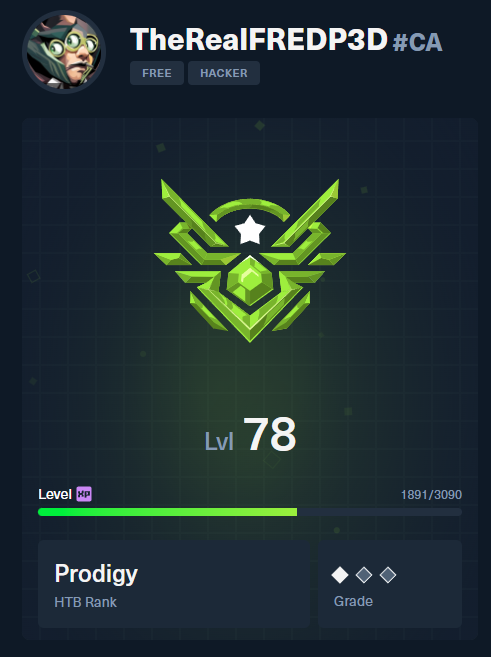
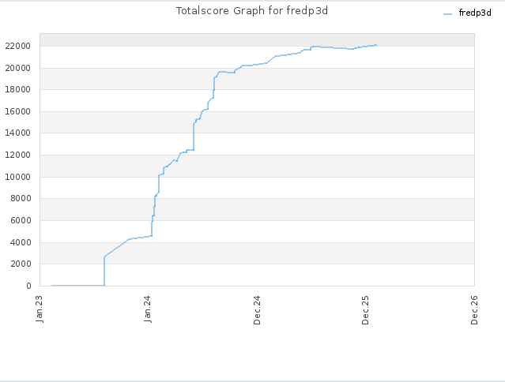
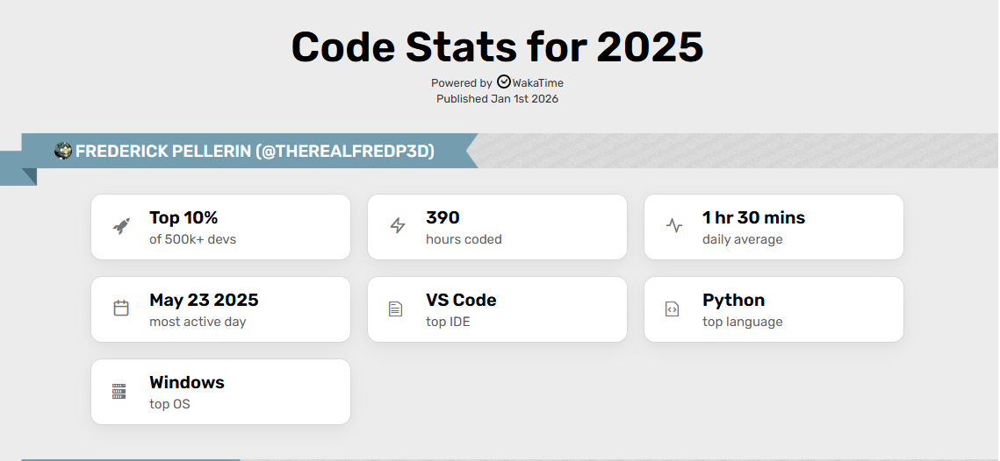

# Frederick Pellerin (TheRealFredP3D)  

  
    
    

  
  
  
  
  

## 👨‍💻 About Me

Tech enthusiast from Quebec City, Canada with a passion for cybersecurity, AI, and software development. My journey began at age 6 when I first touched a keyboard, but it wasn't until I discovered Capture The Flag (CTF) challenges at 37 that I truly found my path.

> "Always learning. Always exploring. Join me on the journey!"

---

## 🔭 Current Focus

- **AI & Machine Learning:** Exploring LLMs and AI applications
- **Cybersecurity:** Training on HackTheBox, TryHackMe, and other platforms
- **Python Development:** Building tools and automation projects
- **Web Development:** Learning static site generators for my upcoming personal website

---

## 🚀 Featured Projects

### [George_Was_Right](https://github.com/therealfredp3d/George_Was_Right)

A crew of AI agents that find world news demonstrating how George Orwell's "1984" remains relevant today. The system generates reports and illustration prompts.

### [Making-BanditGUI](https://github.com/therealfredp3d/Making-BanditGUI)

A GUI tool to help players complete the Bandit challenges on OverTheWire, in a web browser. Still a work in progress.  
`Level 0` is playable now. 

### [Gemini Code Assistant PR Poetry](https://github.com/TheRealFREDP3D/Gemini-Code-Assist-PR-Poetry)  

Just for fun collection of Gemini small poems generated with Pull Request Reviews.  

### [PullPal](https://github.com/TheRealFREDP3D/PullPal)  

Get transcripts of any pull request conversation/commentary and its linked issues. Any PR # from any public repo. Quickly consult old conversation with PR AI bots. Uses Github API. 

### [Mix Coding Exercises](https://github.com/therealfredp3d/Coding-Exercises)

A collection scripts I made learning to code, solving CTF, reading books, etc.  

### [CTF-Toolkit](https://github.com/TheRealFREDP3D/CTF-TUI)  

The CTF Toolkit provides an integrated environment combining terminal operations, note-taking, AI assistance, and tool management in a single, efficient interface. Built with Python's Textual framework, it aims to enhance productivity for CTF players  

---

### Coming Soon

- [X]Personal website documenting my learning journey
  Site is live at [therealfredp.ca](https://therealfred.ca)

- More tools for cybersecurity training and AI experimentation

---

## 🧠 Learning Philosophy

I'm a dedicated self-learner with a straightforward approach:

- **Small Study Sessions:** Consistent, bite-sized learning to absorb concepts effectively
- **Practical Application:** Converting theory into practice through personal projects
- **Continuous Improvement:** Regular writing and coding to refine my skills

---

## 🛠️ Tech Stack

---

## 🏆 Certifications & Achievements

--- 

**📊 Certificates and Completed Courses**

- [Open Credly Profile](https://www.credly.com/users/frederick-pellerin)

- I made a page to keep track of courses and various learning tracks I have completed: [Course Tracker](https://therealfred.notion.site/1d5795af396a80dcab48d1d18ac7b7b2?v=1d5795af396a817f9f88000c068a14f9&pvs=74)

---  
 
## Stats and Misc

**🎯 CTF Platforms**

  

    
    
<small>HackTheBox</small>

  

  

    
    
<small>TryHackMe</small>

  

  

    
    
<small>WeChall.net</small>

  

---

**📊 GitHub Profile Stats**

  
  
  
  

---

**� Activity Stats**

  

    
    
<small>GitRoll</small>

  

  

    
    
<small>WakaTime 2025</small>

  

---  

## ✅ Progress Tracker

- [x] Sort through notes and separate original content from reference material
- [x] Publish on Medium.com
  - [x] Article about planning my career change to IT/Cybersecurity
  - [x] Write-up for TryHackMe's "Brute-It" room
  
- [X] Learn static site generators (Jekyll, Hugo, or 11ty)  
  - [X] Publish a personal website: [https://therealfred.ca](https://therealfred.ca)

**Continous Work**`: Regular writing to improve English language skills

---  

---  

*Last updated: April 21st, 2026*
