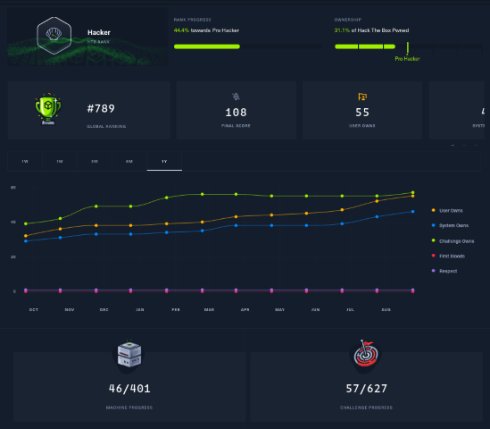

# TheRealFredPD - Github Readme

---

Hi, I’m Frederick Pellerin, a tech enthusiast from Quebec City, Canada. My journey with computers began at 6 years old when I first touched a keyboard. By 19, I was tinkering with technology as a hobbyist, but it wasn’t until I was 37 that I rediscovered my passion through Capture The Flag (CTF) challenges.  

Diving into cybersecurity rekindled my interest in programming, which then led me to explore artificial intelligence and large language models. With a lifelong commitment to self-education, I've immersed myself in these subjects combining hands-on learning experiences.  

Now that I’ve found where my true interests lie, studying is fun and satisfying. I can’t get enough of it.  

Feel free to look around or check out my latest projects!

À bientôt!

---

> Always learning.  
> Always exploring.  
> Join me on the journey!  

---

For several months now, I've dedicated most of my spare time to self-education and hands-on training in fields like networking, AI, software development, and cybersecurity. I especially enjoy participating in Capture The Flag (CTF) challenges, which push my skills to the next level.

---

## Learning Philosophy

I’m a lifelong *self-learner*. My approach is straightforward:

**Small Study Sessions**: Consistent, bite-sized learning to absorb concepts effectively.

**Practical Application**: Turning theory into practice by creating small personal projects.

This method keeps me engaged, and I’ve been enjoying building and experimenting!

---

## Current Projects

[George_Was_Right](https://github.com/therealfredp3d/George_Was_Right): A crew of AI agents find world news to demonstrate how George Orwell's masterpiece, "**1984**", is still relevant today. The team produce a report and illustration prompts.

[BanditGUI](https://github.com/therealfredp3d/BanditGUI): A GUI tool to help players complete the Bandit challenges on Overthewire.

**New Experiments**: Small projects to explore networking protocols, AI implementations, and automation scripts.

**Personal Website**: A dedicated space to document my journey, share insights, and showcase my projects (coming soon).

---

## Why This Repository Exists

Here, you'll find the results of my learning journey, from experiments in code to solutions for challenges. I hope you discover something interesting, and if you'd like to collaborate or share feedback, feel free to reach out.

## Contacts

|  Platform                                                                                                             |              Link                                                       |
|  :---------------------------------------------------------------------------------------------------------------:    |  :-------------------------------------------------------------------:  |
|        |  [TheRealFredP3D](https://twitter.com/TheRealFREDP3D)                   |
|      |  [FredP3D@Proton.me](mailto:fredp3d@proton.me)                          |
|     |  [FredP3D](https://linkedin.com/in/FredP3D)                             |
|        |  [TheRealFREDP3D](https://discordhub.com/profile/1050577907296256070)   |
|                  |  [@TheRealFredP3D](https://medium.com/@TheRealFREDP3D)                  |  
|        |  [FredP3D](https://www.youtube.com/@FredP3D)                            |
|  **NightCafe.Studio Gallery**                                                                                         |  [Nightcafe.studio](https://nightcafe.studio/u/FredP3D)                 |
|  **Link.Gallery**                                                                                                     |  [Link.Gallery](https://link.gallery/therealfredp3d)                    |

---

**`Tryhackme.com - Public Profile Badge`**

---

**`HackTheBox - Profile Badge`**

---

**`WeChall.Net`**  

---

**`echoctf.red`**  

---

**`Hackviser`**  

 
 

---

## Tasks to Complete Before Launching My Website

[X] I need to sort through my notes and separate them from the content I clipped from websites and books. This will ensure that all the information on my website is going to be accurate and relevant and also ensure that I'm the actual author.

[ ] I need to learn how to use a static site generator like Jekyll, Hugo, or 11th. This will allow me to easily create and maintain a website without too much energy, reusing my notes.

[ ] - **(Work in progress)** The fact that English is not my natural language, I need to write regularly to improve my grammar and communication skills. I've been using Grammarly to help me with this, and I plan to continue writing regularly to maintain my progress.  

[X] - **Publish on Medium.com**

  I published a text about how I ended up deeply needing to change my professional path and how a 38-year-old warehouse manager chose without hesitation IT and Cybersecurity as a dream life.  

- I published a write-up for Tryhackme's room: [Brute-It](https://tryhackme.com/room/bruteit).

---

## Latest Focus

- Python training is going fine at a steady pace. I'm about to finish the material to take the **PCEP - Python for Entry-Level Programmer** exam. I don't intend to but the course is great.  
  
- I have been experimenting with AI lately. I finished some courses from Google and Microsoft. I am since experimenting with anything AI related that I can put my hands on.  

- I still train on Hackthebox and some platforms almost daily, but my interest in AI possibilities is growing at a rapid pace. I think AI might overthrow my focus on cybersecurity soon, we'll see...

---

## Actual Toolset

### Software

* Notes: .
* IDE: .

### OS: 

* .
*  VM using VMware Workstation.

---

---

*Modified*: 25-12-2024  
